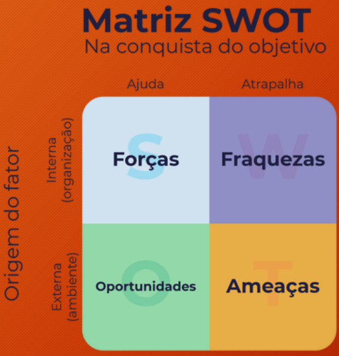

# Aula03 - EAP - Estrutura Analítica do Projeto

## O que é EAP?
EAP é a Estrutura Analítica do Projeto, uma ferramenta de gestão de projetos que visa organizar e distribuir as atividades necessárias para a realização de um projeto. Ela é composta por uma lista de atividades, prazos e responsáveis, e serve para garantir que o projeto seja concluído dentro do prazo estabelecido.

## Definição do Cilco de Vida
- Iniciação
- Planejamento
- Execução
- Monitoramento e Controle
- Encerramento

## Tipos de Ciclo de Vida / Metodologias
- Clássico
    - Incremental
    - Espiral
    - Cascata
- Ágil
    - Scrum
    - Kanban
    - XP
    - Lean
    - FDD
    - Crystal

## Análise de Viabilidade
Viabilidade é a capacidade de um projeto de ser realizado com sucesso. Para determinar a viabilidade de um projeto, é necessário analisar diversos fatores, como custo, prazo, riscos, recursos disponíveis, entre outros.
Uma das ferramentas mais utilizadas para analisar a viabilidade de um projeto é a Matriz SWOT.
### Matriz SWOT

## Análise de Riscos
A matriz SWOT serve para analisar a viabilidade de um projeto, identificando seus pontos fortes, pontos fracos, oportunidades e ameaças. Com base nessa análise, é possível identificar os **riscos** do projeto e tomar medidas para mitigá-los.